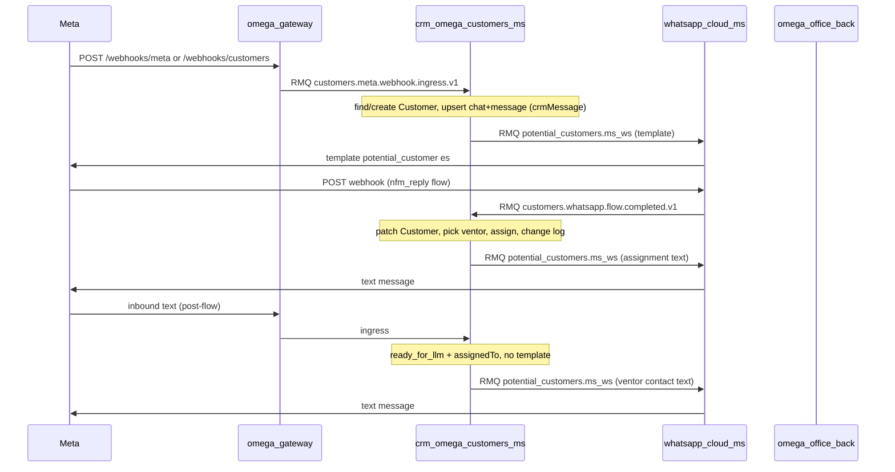

# Meta potential-customer WhatsApp funnel — change summary

Short reference for onboarding a new chat or reviewer. Spans **omega_gateway**, **crm-omega-customers-ms**, **whatsapp_cloud_ms**, **omega_office_back**.

---

## Goal

Inbound WhatsApp (Meta Cloud API) for a **dedicated CRM WABA** → persist **Customer** + conversations in **customers-ms** → send **`potential_customer`** template (es) → user completes **WhatsApp Flow** → assign **physical ventor** (load-balanced, 28 days) → notify customer in Spanish → existing customers can get **LLM** replies (gated on CRM lookup).

**Isolation:** WhatsApp ingress does **not** fan out to `crm_back_queue` / **`LeadCandidate`**. Meta **Lead Ads** (`clientes*` forms) also stay in customers-ms only.

**Second ingress — Meta Lead Ads campaigns:** Ceiba Page webhook → gateway Graph fetch → form name `clientes*` → `customers.meta.leadgen.ingest.v1` → `meta_lead_campaigns` + `Customer` upsert → **auto-assign ventor** (load balance by assignments in last **24h**, env `VENTOR_ASSIGNMENT_META_CAMPAIGN_WINDOW_HOURS`). No WhatsApp template on this path. Form name `referidos*` → `office.facebook.leadgen.ingest.v1` → existing `facebookleads` + ventor provisioning in office_back.

---

## End-to-end flow (WhatsApp)



**Inbound auto-reply (phase 1):** After flow, each inbound text/button that does **not** trigger `potential_customer` template → `CustomerMetaInboundReplyService` sends assigned ventor contact (`send.potential_customer_text`). **Phase 2:** DeepSeek La Ceiba replies (whatsapp_cloud_ms), not via local webhook.

---

## omega_gateway

| HTTP | Behavior |
|------|----------|
| `POST /webhooks/meta` | Envelope → **`customers.meta.webhook.ingress.v1`** (WhatsApp `messages` only downstream). |
| `POST /webhooks/customers` | Same as meta → ingress; assigns ventor on inbound message if unassigned. |
| `GET /webhooks/customers` | Meta verify challenge. |
| `GET/POST /webhooks/ceiba` | Page **Lead Ads** (`leadgen`): Graph fetch with `FB_BUSINESS_CEIBA_TOKEN` / `_PROD`, route by form name → `customers.meta.leadgen.ingest.v1` or `office.facebook.leadgen.ingest.v1`. Unknown form prefix: log + skip. |

**Files:** `src/webhook/webhook.service.ts`, `meta-lead-ads.service.ts`, `meta-lead-ads-router.service.ts`.

**Optional env (if re-enabled):** `META_WEBHOOK_EXCLUSIVE_PHONE_NUMBER_IDS` — comma-separated `metadata.phone_number_id` allowlist (only forward matching WABA).

---

## crm-omega-customers-ms

### RabbitMQ

| Pattern | Role |
|---------|------|
| `customers.meta.webhook.ingress.v1` | Ingest Meta WhatsApp webhook envelope from gateway |
| `customers.meta.leadgen.ingest.v1` | Ingest Meta Lead Ads campaign lead (gateway pre-fetched Graph) |
| `customers.whatsapp.flow.completed.v1` | Flow completion from whatsapp_ms |
| (outbound) `potential_customers.ms_ws` | Commands to whatsapp_ms on **`ws_ms_queue`** |

Queue consumed: `crm.customers.whatsapp_integration` (see `configuration.ts` `integrationQueue`).

### Main services / controllers

| File | Responsibility |
|------|----------------|
| `customer-meta-webhook-rmq.controller.ts` | `@EventPattern('customers.meta.webhook.ingress.v1')` |
| `customer-meta-webhook.service.ts` | Parse Meta `entry[].changes[]` (`field === 'messages'`), create/find **Customer**, **assign ventor** (gateway 24h window), upsert chat/message, emit template when needed |
| `customer-meta-inbound-reply.service.ts` | When template is skipped and `ready_for_llm` + `assignedTo`, emit ventor contact text on each inbound text/button |
| `customer-meta-leadgen-rmq.controller.ts` | `@EventPattern('customers.meta.leadgen.ingest.v1')` |
| `customer-meta-leadgen.service.ts` | Upsert **`meta_lead_campaigns`**, find/create **Customer**, assign ventor via **`CustomerVentorAssignmentService`** (24h window) |
| `customer-ventor-assignment.service.ts` | Fetch physical ventors from office_back; count `assignedTo` in configurable window; pick minimum load |
| `meta-lead-campaign.schema.ts` | Persist full Graph + webhook metadata per `leadgenId` |
| `customer-whatsapp-flow-completed-rmq.controller.ts` | `@EventPattern('customers.whatsapp.flow.completed.v1')` |
| `customer-whatsapp-flow-completed.service.ts` | Map flow JSON → Customer fields, fetch ventors from office_back, 28-day assignment counts, assign, audit, emit assignment WhatsApp text |
| `customer-potential-customers-outbound.service.ts` | `WS_MS_QUEUE` → `emit('potential_customers.ms_ws', …)` |

### Schema changes

**`customer.schema.ts`**

- `whatsappPotentialCustomerStatus`: `none` \| `pending_flow` \| `completed_flow` \| `ready_for_llm`
- `metaPotentialTemplateSent`: boolean
- JSDoc: not synced to office_back `LeadCandidate` by default

**`customer-whatsapp-chat.schema.ts`**

- `crmMessage: boolean` — Meta gateway ingest (no referral `userSessionId`)

### Template send conditions (`customer-meta-webhook.service`)

Emit `send.potential_customer_template` when:

- Customer **just created** OR `whatsappPotentialCustomerStatus === 'pending_flow'`
- AND `metaPotentialTemplateSent !== true`
- AND status is not `ready_for_llm`

Stable IDs: `sessionId = cloud:{phoneNumberId}:{waId}`, `chatId = normalizedWaId`.

### Ventor assignment (`customer-whatsapp-flow-completed.service`)

1. `GET {OFFICE_BACK_INTERNAL_BASE_URL}/rest/internal/ventors/physical-assignment-candidates` with header `X-Internal-Key`.
2. Filter ventors: `level = ventor (4)`, `physical = true`, `enable = true` (office_back).
3. Count customers per ventor: `assignedTo` + `assignedDate` in **[today−28d 00:00:00, now]** (ISO strings).
4. `console.log` `{ windowStart, windowEnd, timeZone, countsByVentorId }`.
5. Pick minimum count; tie-break by lexicographic ventor id.
6. Set `assignedTo`, `assignedDate`, `whatsappPotentialCustomerStatus = 'ready_for_llm'`, save (audit via hooks).

### API / stats

- `GET /customers-rest/customer/mine/stats` — added **`customersAssignedLast28Days`** (same window as assignment).

### Copy / utils

- `constants/ventor-assignment-message.constant.ts`
- `utils/format-ventor-assignment-message.util.ts`

### Env (customers-ms)

| Variable | Purpose |
|----------|---------|
| `CUSTOMERS_META_INGEST_ACTOR_ID` | `createdBy` for Meta-created customers (default `meta-gateway-ingest`) |
| `OFFICE_BACK_INTERNAL_BASE_URL` or `OMEGA_OFFICE_BACK_URL` | Monolith base URL |
| `OFFICE_BACK_INTERNAL_API_KEY` | Must match office_back |
| `VENTOR_ASSIGNMENT_TZ` | Logged (default `America/Bogota`) |
| `RABBITMQ_URL` / `RABBIT_MQ_*` | Required for RMQ consumers + `WS_MS_QUEUE` emit |

---

## whatsapp_cloud_ms

### Inbound from customers-ms

| Pattern | Queue | Handler |
|---------|-------|---------|
| `potential_customers.ms_ws` | `ws_ms_queue` | `PotentialCustomersMsEventsController` + `PotentialCustomersMsEventsService` |

**Actions:**

- `send.potential_customer_template` → `WhatsappCloudService.sendTemplatePotentialCustomer` (`potential_customer`, `es`)
- `send.potential_customer_text` → `sendCustomersTextMessage` (customers line; ventor assignment / marketing auto-reply)

**Module:** `src/potential-customers/potential-customers.module.ts` (imported in `app.module.ts`).

**Not used for this funnel:** `WhatsappOnboardingEventsController` / `ms_ws_cloud` (onboarding / monolith).

### Flow completion → customers-ms

`WhatsappCloudController` webhook: on `interactive.type === 'nfm_reply'`, emit **`customers.whatsapp.flow.completed.v1`** to `crm.customers.whatsapp_integration` (`CUSTOMERS_MS_INTEGRATION` client).

### LLM (phase 2 — not production ingress today)

`maybeSendDeepSeekLotesReply` in local `POST /whatsapp-cloud/webhook` only. Production CRM WABA uses gateway → customers-ms; DeepSeek will be wired via new RMQ action when phase 2 lands.

### Constants

- `src/constants/app-constants.ts` — `VENTOR_ASSIGNMENT_CUSTOMER_MESSAGE_TEMPLATE` (placeholders `[user_name]`, `[user_phone]`)

---

## omega_office_back

| Route | Auth | Returns |
|-------|------|---------|
| `GET /rest/internal/ventors/physical-assignment-candidates` | Header `X-Internal-Key` = `OFFICE_BACK_INTERNAL_API_KEY` | `{ ventors: [{ id, name, lastName, phone, phoneJob }] }` |

**Files:** `features/internal-ventors/`, `UsersService.getPhysicalVentorsForCrmAssignment()`.

---

## Debugging

1. **Gateway:** log `Forwarding customers webhook to crm-omega-customers-ms` / Meta path.
2. **customers-ms:** `CustomerMetaWebhookService` logs — start, per-message, create vs existing, upsert, `shouldSendTemplate`, emit.
3. **customers-ms outbound:** warn if `rabbitmq.url` empty (template skipped).
4. **whatsapp_ms:** `PotentialCustomersMsEventsService` + template send logs in `WhatsappCloudService`.
5. **Flow:** whatsapp_ms emit `customers.whatsapp.flow.completed.v1` → customers-ms ventor `console.log` counts.

Set Nest **`LOG_LEVEL=debug`** for verbose ingress payload in `CustomerMetaWebhookRmqController`.

---

## Meta / product checklist

- [ ] Template **`potential_customer`** approved in Business Manager (`es`); body param **`contact_name`** if using name in template (adjust in `sendTemplatePotentialCustomer` if different).
- [ ] WhatsApp Flow field keys aligned with `customer-whatsapp-flow-completed.service` mapper (`full_name`, `email`, `document`, etc.).
- [ ] Meta webhook URL points to gateway **`/webhooks/customers`** (or `/webhooks/meta`) for the **exclusive** WABA.
- [ ] `WHATSAPP_CLOUD_PHONE_NUMBER_ID` in whatsapp_ms matches webhook `phone_number_id`.
- [ ] RabbitMQ: `crm.customers.whatsapp_integration` + `ws_ms_queue` running; customers-ms + whatsapp_ms connected.

---

## Related files (quick index)

```
omega_gateway/
  src/webhook/webhook.service.ts
  src/webhook/webhook.controller.ts

crm-omega-customers-ms/
  src/customer/customer-meta-webhook*.ts
  src/customer/customer-whatsapp-flow-completed*.ts
  src/customer/customer-potential-customers-outbound.service.ts
  src/customer/schemas/customer.schema.ts
  src/customer-conversations/schemas/customer-whatsapp-chat.schema.ts

whatsapp_cloud_ms/
  src/potential-customers/*
  src/whatsapp-cloud/whatsapp-cloud.service.ts (sendTemplatePotentialCustomer)
  src/whatsapp-cloud/whatsapp-cloud.controller.ts (nfm_reply, LLM gate)

omega_office_back/
  src/features/internal-ventors/*
  src/features/users/users.service.ts (getPhysicalVentorsForCrmAssignment)
```
