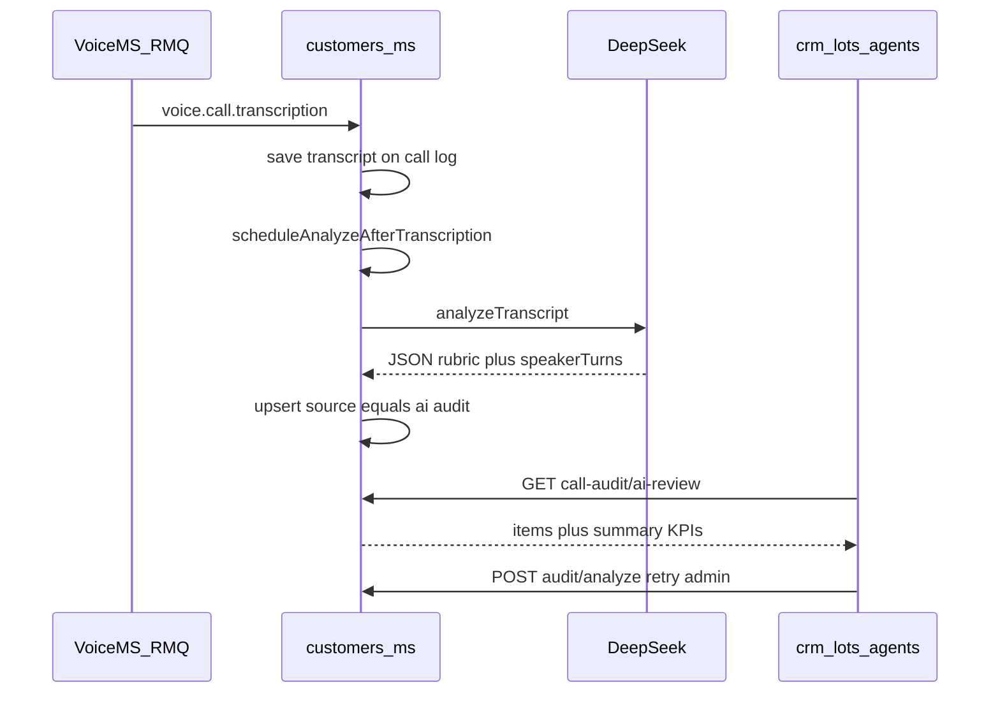

# Call audit AI — feature resume

For HTTP paths and query params, see [`call-audit-api.md`](call-audit-api.md).

## Purpose and scope

- **Goal:** Quality audit of **answered** VOIP + Google Meet customer calls — weighted sales rubric (0–100) + customer **interest score** (1–5).
- **System of record:** `crm-omega-customers-ms` — MongoDB `customer_call_audits`, module `src/customer/call-audit/`.
- **Call logs:** `customer_call_logs` (VOIP transcript from `voice.call.transcription`; Meet from Workspace Events / refresh).
- **Not in scope:** onboarding voice audit in `omega_office_back`; `referrals-boost`.
- **Admin UI:** `crm_lots_agents` — `/dashboard/customers-v2/call-audit`, `/dashboard/customers-v2/call-audit-ai`.

## Data model (`CustomerCallAudit`)

| Field | Role |
|-------|------|
| `indicators[]` | `{ key, label, passed, maxPoints, pointsEarned, rationale?, evidence? }` |
| `totalScore`, `maxScore` | Sum of earned / max points (typically max 100) |
| `interestScore` | Integer 1–5 (+ optional rationale) |
| `speakerTurns[]` | `{ role, text, startMs?, endMs?, speakerLabel? }` |

## Rubric (config `2026-09-v3`)

`saludo` 10, `descubrimiento` 20, `argumentacion` 15, `manejo_objeciones` 15, `cierre` 15, `rapport` 10, `escucha_activa` 10, `registro_crm` 5 (= **100**). Pass/fail per indicator; server computes points.

Meet: timed utterances → LLM transcript; Drive Doc fallback when API entries empty; auto-analyze after Meet sync.

## End-to-end flow

**Behaviors (`customer-call-audit.service.ts`):**

- After transcription ingest: `scheduleAnalyzeAfterTranscription` runs AI in `setImmediate` (errors logged; RMQ handler not blocked).
- Manual re-run: `POST admin/customer/call-logs/:callLogId/audit/analyze` (CRM admin only).
- AI upsert: `pending` → `completed` or `failed` (`llmError` on failure).
- Month filters (AI review, eligible calls): **call completed date** — Twilio `completed` event → `completedAt`; fallback `callLog.createdAt`. Not `analyzedAt`. See `utils/resolve-call-audit-call-date.util.ts`.
- Eligible for AI review: answered outcome, non-empty transcript, `agentExternalRef` set.

## AI review summary (KPIs)

Built by `utils/build-call-audit-ai-review-summary.util.ts` over the **full filtered set** (before pagination):

| Field | Meaning |
|-------|---------|
| `dateBasis` | Always `callCompletedAt` |
| `totalEligible` | Answered calls with transcript in month |
| `aiCompleted` / `aiPending` / `aiFailed` / `aiNone` | AI audit status counts |
| `avgInterestScore` | Mean score when AI `completed` (null if none) |
| `topFailedIndicators` | Top 3 rubric labels by fail count across completed AI audits |

**Consumers:**

- `GET call-audit/ai-review` — `listAiReviewForAdmin`
- `crm_lots_agents` — `call-audit-ai-review-page.tsx`, KPI/table components, `customer-call-audit.slice.ts`
- CEO operations summary — `getCallAuditAiReview({ limit: 1 })` for summary only (admin; skipped for non-admin)

## Human audit (same collection)

| Action | Endpoint |
|--------|----------|
| Submit checklist | `POST call-logs/:callLogId/audit` |
| Supervisor resume list | `GET call-audit/results` — `indicatorsSummary: { passed, total, failedLabels[] }` |
| Auditor quota | `GET call-audit/auditor-progress` — `required` (default 3/month) |

UI: `call-audit-queue-page.tsx`, `call-audit-form-dialog.cp.tsx` (human section + read-only AI).

## Auth and visibility

- Base: `admin/customer` + JWT `token` header (`customer-admin.controller.ts`).
- Admin only: `GET call-audit/ai-review`, `POST call-logs/:callLogId/audit/analyze` (`assertOfficeAdmin`, `UserLevel.admin` = 0).
- `GET call-logs/:callLogId/audits`: `ai` included only when `jwtUser.level === 0`.

## Key files (agents)

| Layer | Path |
|-------|------|
| Schema | `src/customer/call-audit/schemas/customer-call-audit.schema.ts` |
| Service | `src/customer/call-audit/customer-call-audit.service.ts` |
| Types / DTOs | `src/customer/call-audit/types/`, `dto/` |
| HTTP | `src/customer/customer-admin.controller.ts` |
| RMQ | `src/customer/voice-call-rmq.controller.ts` → `customer-call-logs.service.ts` |
| Admin client | `crm_lots_agents/src/features/customer-v2/services/customers-ms-admin-call-audit.http.ts` |
| Redux | `crm_lots_agents/src/features/customer-v2/redux/customer-call-audit.slice.ts` |

## Environment

- `DEEPSEEK_API_KEY` (required for AI); optional `deepseek.baseUrl`
- `callAudit.requiredHumanAuditsPerMonth` (Nest config; default 3)
- `ventorAssignment.timeZone` — month boundaries (default `America/Bogota`)
